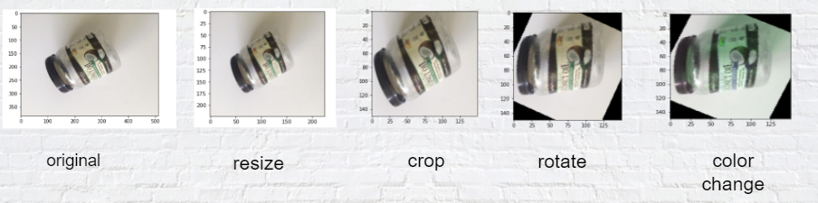

# Garbage Classification
 Machine Learning on Garbage Classification

Thanks to Peyi yu, Hongliang Wang, Yangchi Fang, and I (Jintao Xu) working on this waste sorting project.

1.0 Brief Project Description
Garbage classification is a scientific management method for effective garbage disposal. It helps people maximize the utilization of waste resources and prevent deteriorating environmental conditions [1]. However, This method is not implemented effectively due to the lack of awareness of garbage classification [2][3][Figure 1]. Therefore, our group came up with an idea of using the machine to notify which garbages belong to their specific group. We consider that machines can easily handle this problem because of picture recognition and data analysis, these current technologies enabling the machines to produce a relatively accurate result of classification. 
Our project aims to build a model that helps the machine recognize four different garbage categories [Figure 2]. As a result, our model will automatically recognize the garbage features on any other image.

2.0 Model

We choose Renet18

3.0 Data augmentation 

4.0 Performance and the result

5.0 Anvil app

